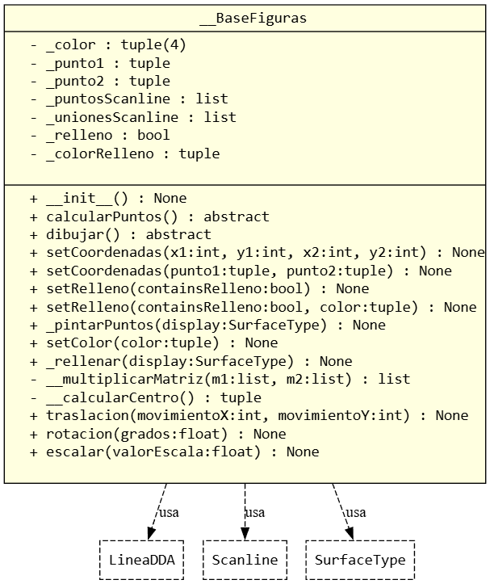
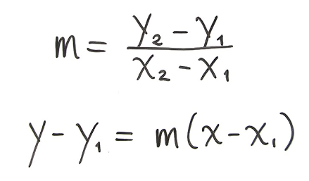
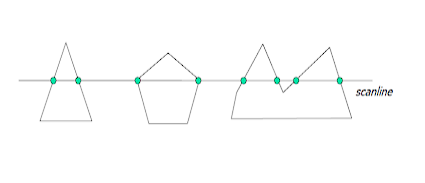
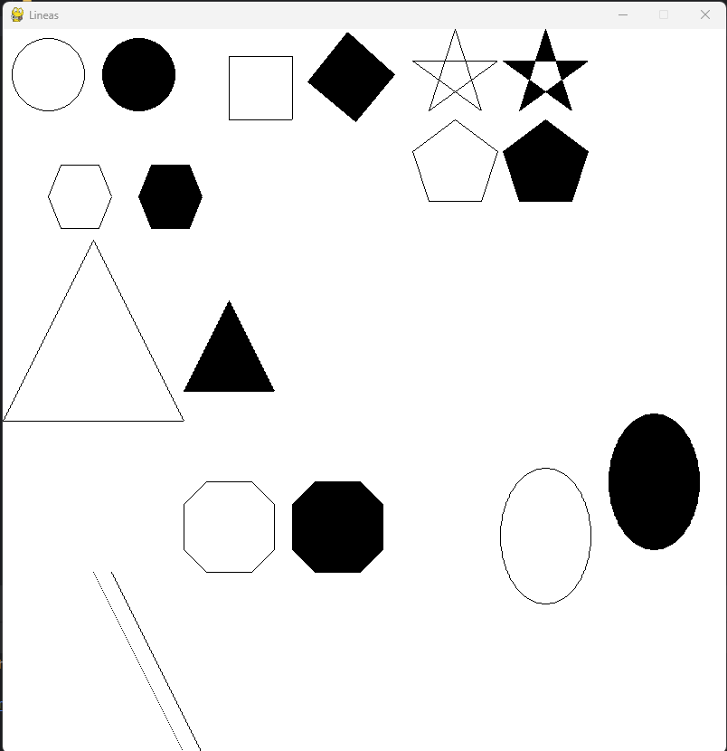
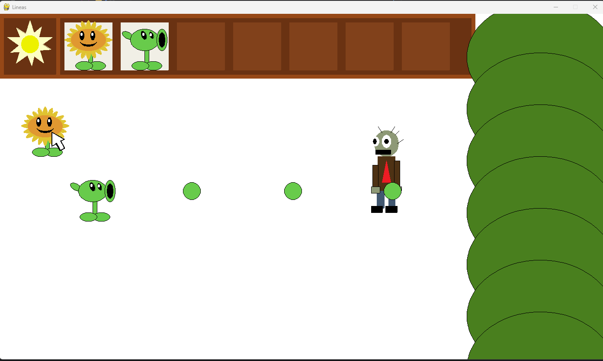
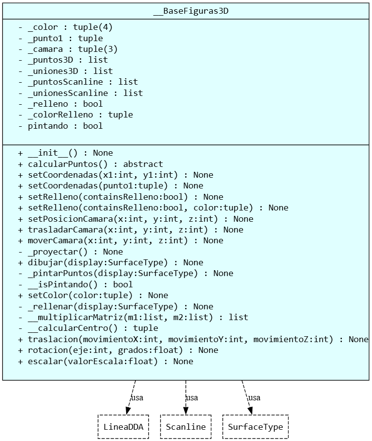
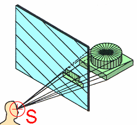
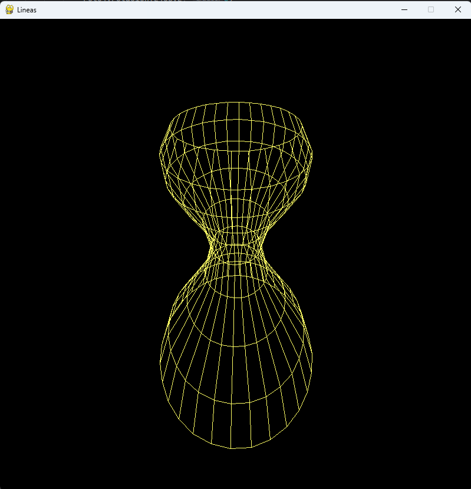
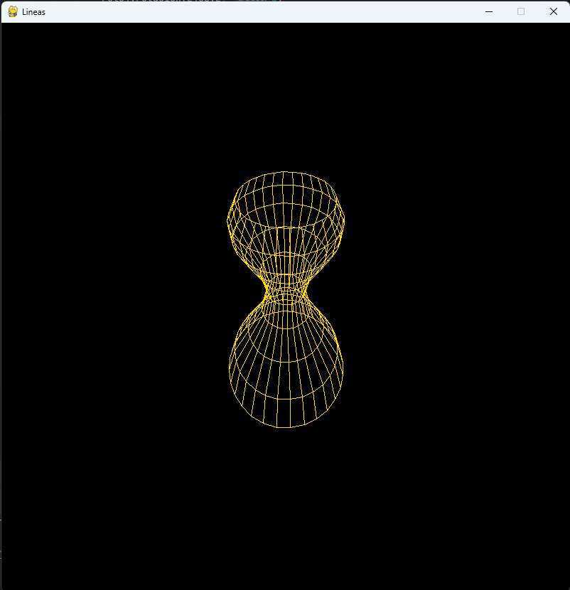

# Graficas por computadora 2D y 3D

Materia donde se tiene en cuenta como es que se usa calculos matematicos
para hacer que se observen pixeles y hacer que el conjunto de ellos 
muestren figuras en 2D y apartir de proyecciones pasar objetos en un plano
3D se puedan observar dentro del plano 2D
---
## Primer parcial

diagrama de clase de la base de lo que se utiliza para crear las figuras
que heredan de este misma y se le hace override a las funciones **dibujar( )**
y **calcularPuntos( )** para que de esta manera cada figura haga lo que necesita
para crear su propia figura donde todo lo demas es lo que cualquier figura ya
va a tener que hacer, donde ademas podemos ver que esta clase usa otros objetos
los cuales son los siguientes:

### LineaDDA

lineaDDA es una forma de crear lineas con pixeles dentro de lo que seria
nuestro lienzo, este es a partir de la ecuacion de la linea recta de 
algebra lineal:

pero con algunas modificaciones ya que al usar esta formula dentro del
lienzo dependiendo la pendiente de la linea puede que la linea quede con 
espacios en blanco entonces lineaDDA evita que haya esos espacios dando
diferente escala de pasos y no de 1 en uno como se esperaria de la 
formula original, haciendo que pueda que haya dos puntos sobre el mismo
eje pero que el resultado se vea como una linea recta de principio a fin.

### Scan Line

el metodo scan line es una forma de rellenar las figuras que estamos haciendo
esto haciendo que el eje **Y** sea nuestro punto de partida y tal como lo dice
el metodo escanea el eje buscando las lineas de interseccion de los puntos,
para asi rellenar todo el espacio dentro de esas dos lineas que se intersectan
teniendo como idea principal lo siguiente: 

donde se puede ver que esta una linea partiendo el eje **Y** donde se ven 
2 puntos que es donde va a pintar y en caso que que haya 4 puntos como 
se ve en la ultima figura entonces se salta el espacio entre el punto 2
y el punto 3 y se pinta el resto y asi se va recorriendo ele eje y desde
el punto mas alto de la figura hasta el final

---

## RESULTADOS

estos son los resultados por separado de cada uno de las figuras

y esta es la creacion de una animacion con todas las figuras que se tienen

---

## Segundo parcial

para el segundo parcial se plantea la visualizacion de figuras 3D
en el plano 2D para lo cual se ocupo la misma base de figuras para 
pero ahora para 3D haciendo sus diversos cambios

donde aqui lo unico que cambia es que ahora se tiene una lista de los puntos
que se tienen pero ahora del plano 3D y se mantienen las listas del plano 
2D ya que estos puntos en el plano 3D se proyectan dentro del plano 2D.
todo de la siguiente manera:

donde se tiene como idea principal la imagen anterior donde se tiene un
sujeto o camara que es un punto en el espacio 3D del cual se trazan 
lineas de donde esta hasta todos los puntos que esta visualizando
y este por formula se tiene que cortar en algun punto que en este caso 
lo corto en 0 del eje **Z** haciendo que entre mas cerca este el punto
de camara del 0 de **Z** la diferencia de la distancia de los puntos 
que esten mas cerca de los que esten mas lejos en la proyeccion se va a 
ver mas grande dandole mas profundidad al plano y entre mas lejos del 
plano de corte hace que no se note mucho la profundidad de los objetos.

## Resultado

